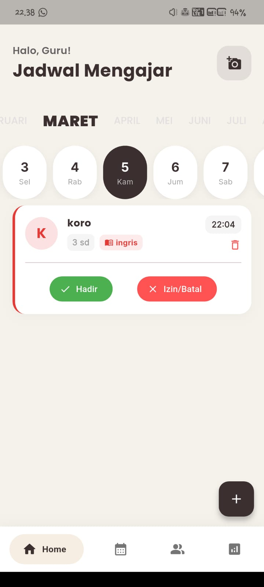
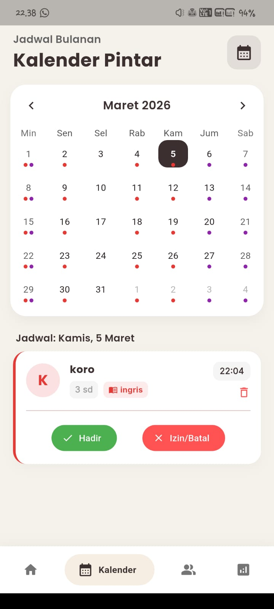
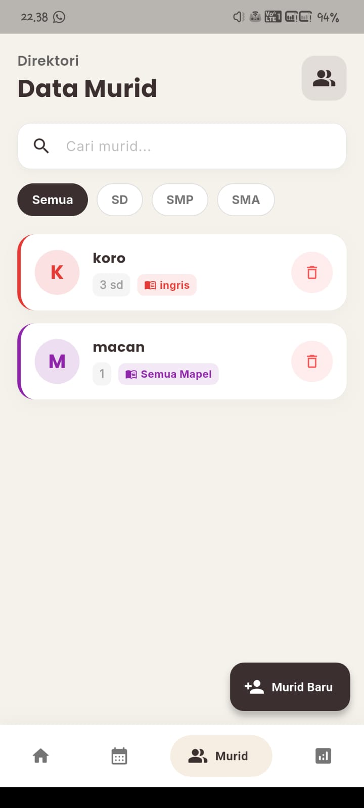
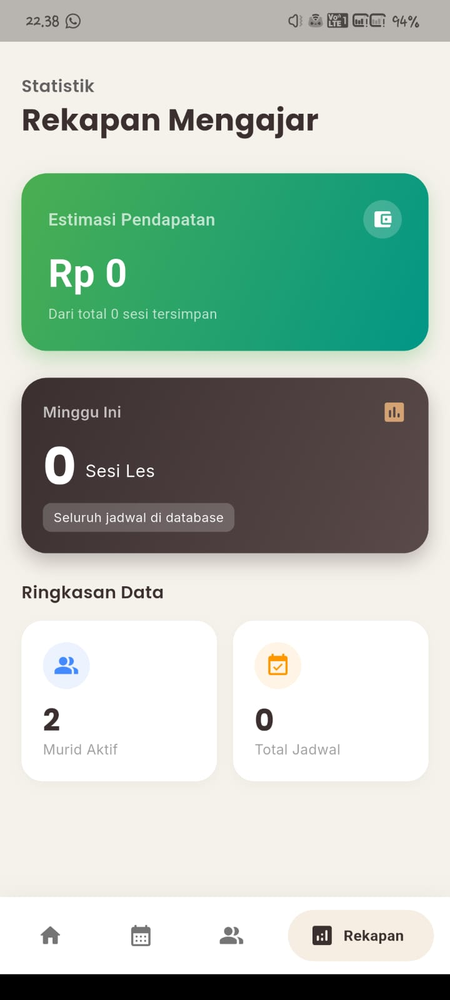

# 🎓 K-Les: Aplikasi Manajemen Les Privat


K-Les adalah aplikasi _mobile_ berbasis Flutter yang dirancang khusus untuk membantu guru les privat mengelola jadwal mengajar, data murid, dan merekap pendapatan bulanan secara efisien dan profesional. Dibangun dengan pendekatan **Clean Architecture** dan UI/UX yang memanjakan mata.

---

## ✨ Fitur Unggulan

- 👥 **Manajemen Direktori Murid:** Tambah, cari, dan filter data murid berdasarkan tingkat pendidikan (SD, SMP, SMA) secara instan.
- 📅 **Kalender Pintar & Penjadwalan:** Pantau jadwal mengajar harian menggunakan antarmuka kalender interaktif.
- 💰 **Dashboard Finansial:** Rekap otomatis estimasi pendapatan bulanan dan total sesi mengajar aktif.
- 📲 **Integrasi WhatsApp:** Cetak nota tagihan/invoice rahasia dan bagikan langsung ke orang tua murid via WhatsApp dengan satu klik.
- 🎨 **Desain Elegan (Deep Brown Theme):** Antarmuka modern yang responsif, rapi, dan nyaman digunakan berlama-lama.
- ⚡ **Offline-First:** Data tersimpan aman di penyimpanan lokal perangkat, siap diakses kapan pun tanpa butuh internet.

---

## 🏗️ Arsitektur & Teknologi

Aplikasi ini dibangun dengan standar industri _Best Practice_ untuk skalabilitas dan pemeliharaan kode:

- **Framework:** Flutter SDK
- **State Management:** Provider
- **Pola Arsitektur:** Pemisahan ketat antara logika bisnis (Providers) dan antarmuka (UI/Screens).
- **Struktur Direktori (Clean Code):**
  - `lib/models/` : Representasi struktur data (_Data Classes/Entities_) seperti data Murid dan Jadwal.
  - `lib/database/` : Konfigurasi dan servis _database_ lokal (Isar/SQLite) untuk penyimpanan _offline_.
  - `lib/providers/` : Pengelola logika bisnis (_State Management_) yang menjembatani _database_ dan UI.
  - `lib/screens/` : Modul halaman utama (Home, Student, Calendar, Summary).
  - `lib/widgets/` : Komponen antarmuka global yang dapat digunakan kembali (_reusable widgets_).
  - `lib/screens/.../widgets/` : Komponen antarmuka lokal khusus untuk satu halaman (_modular logic_).
  - `lib/theme/` : Sentralisasi sistem warna (_Deep Brown Theme_) dan tipografi.

---

## 📸 Cuplikan Layar (Screenshots)

<p align="center">
  
  &nbsp;&nbsp;&nbsp;
  
  &nbsp;&nbsp;&nbsp;
  
  &nbsp;&nbsp;&nbsp;
  
</p>

## 🚀 Cara Menjalankan Aplikasi (Instalasi)

1. Pastikan kamu sudah menginstal [Flutter](https://flutter.dev/docs/get-started/install) di komputermu.
2. _Clone repository_ ini:
   ```bash
   git clone [https://github.com/username-kamu/k_les.git](https://github.com/username-kamu/k_les.git)
   ```
